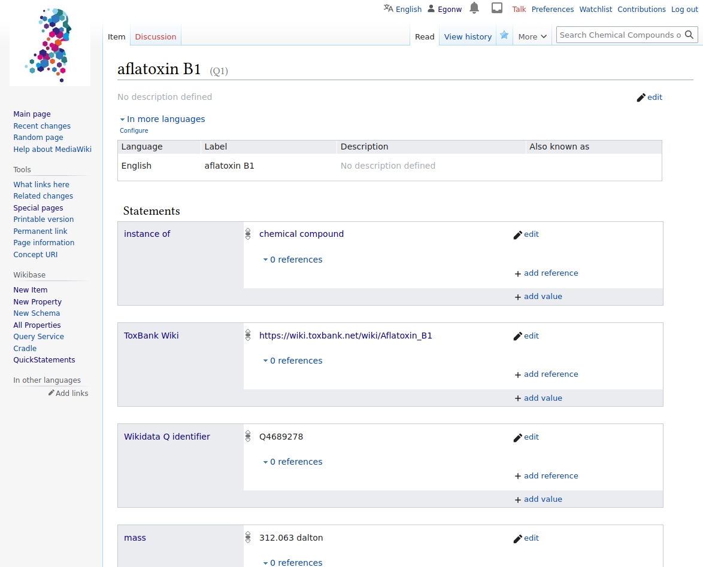
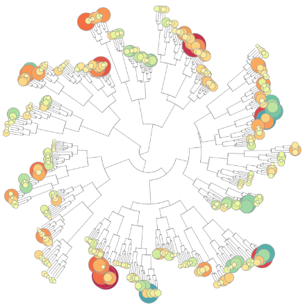
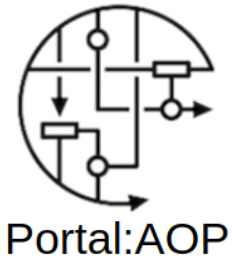

# VHP4Safety Cloud Services

VHP4Safety needs a cloud with a high diversity of services to support their case studies.
The services will run on (interal) but also outside (external) the VHP4Safety cloud,
on a case by case basis.

This webpage gives an overview of the VHP4Safety Cloud Services on the Production and
Development platforms. The second is where we develop and test cloud services, while the
first runs a stable version of the service.

Below you find an overview of services available in the context of the VHP4Safety Platform.
[Additional services have been suggested](https://github.com/VHP4Safety/cloud/labels/service)
and users can [request additional services](https://github.com/VHP4Safety/cloud/issues/new/choose).

## Cloud catalog

The VHP4Safety Cloud catalog of potential, internal, and external services is
available [here](catalog.md).

## Production VHP4Safety Platform

There currently is no production platform yet.

## Development VHP4Safety Platform

The current development platform runs several services.

### AOP-Wiki Snorql UI

Graphical interface to an AOP-Wiki SPARQL endpoint. [[more info](service/aopwiki.md)]

\

### CDK Depict

A webservice that converts a SMILES into 2D depictions (SVG or PNG). [[more info](service/cdkdepict.md)]

### SOM Prediction

A webservice for protein-structure and reactivity based (P450) site-of-metabolism prediction. [[more info](service/sombie.md)]

\

### VHP4Safety Wikibase

A Wikibase instance to hold information about compounds. [[more info](service/wikibase.md)]

## External Services

### BridgeDb

A framework to map identifiers between various biological databases and related sources. [[more info](service/bridgedb.md)]

### PopGen

A service to generate online virtual human population. [[more info](service/popgen.md)]

### SysRev

A service to support literature research. [[more info](service/sysrev.md)]

\

### TXG-MAPr

An R-Shiny-based implementation of weighted gene co-expression network analysis (WGCNA) obtained from the Primary Human Hepatocytes (PHH) TG-GATEs dataset. [[more info](service/txg_mapr.md)]

\

### WikiPathways - AOP Portal

This Adverse Outcome Pathway (AOP) portal for WikiPathways to highlight the molecular basis of AOPs or events in AOPs. [[more info](service/wikipathways_aop.md)]

### Funding

VHP4Safety – the Virtual Human Platform for safety assessment project
[NWA 1292.19.272](https://www.nwo.nl/projecten/nwa129219272) is part of the NWA
research program ‘Research along Routes by Consortia (ORC)’, which is funded by the Netherlands Organization
for Scientific Research (NWO). The project started on June 1, 2021 with a budget of over 10 million Euros
and will last for the duration of 5 years. 
