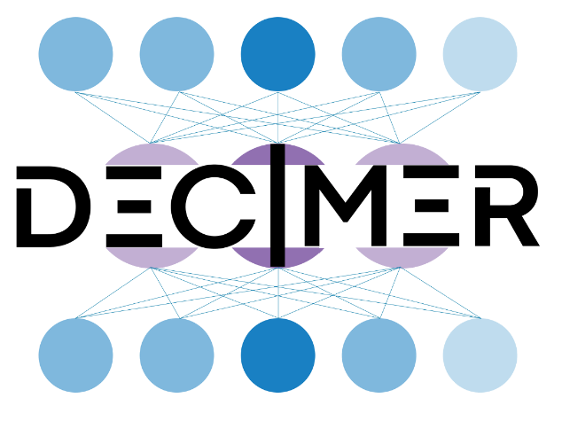

# DECIMER

Online service to extract chemical structures from PDFs and images.

## External Service

* Website: [https://decimer.ai/](https://decimer.ai/)
* Login required: No
* Implementation status: -
* TLR: -
* Type: -
* Contact: Egon
* API Type: -
* Categories: -
* Targeted users: Researchers
* Relevant VHP4Safety Use case: -

## Tool specifications

* Provided by: University of Jena
* Citation: https://doi.org/10.1186/s13321-021-00538-8
* Version? Latest
* License? [MIT license](https://github.com/Kohulan/DECIMER-Image_Transformer/blob/master/LICENSE)
* Source Code? https://github.com/Kohulan/DECIMER-Image_Transformer
* Docker? https://github.com/OBrink/DECIMER_Web
* ELIXIR Bio.tools?
* ELIXIR TeSS?

## Tool integration

- [ ] Utilises the VHP4Safety APIs to ensure that each service is accessible to our proposed interoperability layer.
- [ ] Is annotated according to the semantic interoperability layer concept using defined ontologies.
- [ ] Is containerised for easy deployment in virtual environments of VHP4Safety instances.
- [ ] Has documented scientific and technical background.
- [ ] Is deployed into the VHP4Safety development environment.
- [ ] Is deployed into the VHP4Safety production environment.
- [ ] Is listed in the VHP4Safety discovery services.
- [ ] Is listed in other central repositories like eInfraCentral, bio.tools and TeSS (ELIXIR).
- [ ] Provides legal and ethical statements on how the service can be used.

